# Lesson 49 - SQL Backup Database

---

# Introduction

In this lesson, we learned about:

**Backing Up a SQL Database**

How to create copies of database data to prevent data loss. A backup is a copy of data from a SQL database that can be used to reconstruct the data in case of hardware failure, system crashes, or data corruption.

---

# What is SQL Database Backup?

A database backup is a complete or partial copy of a database's structure and data, saved to an external storage medium such as:

* Local Disk
* Network Share
* Cloud Storage

In production environments, backups are an important part of any Disaster Recovery (DR) plan.

They help ensure business continuity in case of:

* Hardware or Storage Failure
* Accidental Data Deletion or Modification
* Software Corruption
* Ransomware or Cyberattacks

---

# Backup Strategy Mind Map

Below is a visual overview of SQL Database Backup types, options, and best practices:

```mermaid
graph TD

    Root[SQL Database Backup]:::main

    Root --> Types[Backup Types]:::category
    Root --> Syntax[Syntax & Commands]:::category
    Root --> BestPractices[Best Practices]:::category
    Root --> Constraints[Important Rules & Constraints]:::category

    Types --> Full[Full Backup<br/>Copies entire database]:::detail
    Types --> Diff[Differential Backup<br/>Changes since last Full]:::detail
    Types --> Log[Transaction Log Backup<br/>All transaction logs for point-in-time recovery]:::detail

    Syntax --> CmdBackup["BACKUP DATABASE DB_Name<br/>TO DISK = 'path.bak'"]:::detail
    Syntax --> CmdOptions[WITH Options<br/>COMPRESSION, FORMAT, STATS]:::detail

    BestPractices --> Auto[Automate using SQL Server Agent]:::detail
    BestPractices --> Test[Test restores regularly]:::detail
    BestPractices --> Offsite[Store backups offsite]:::detail

    Constraints --> Perms[sysadmin / db_owner roles required]:::warning
    Constraints --> Space[Sufficient disk space is critical]:::warning
    Constraints --> Permissions[SQL Service account must have write permissions to path]:::warning
```



---

# SQL Backup Database Syntax (SQL Server)

To back up a database in Microsoft SQL Server, we use the `BACKUP DATABASE` statement.

## 1. Full Backup (Default)

A Full Backup creates a complete copy of the database.

### Syntax

```sql
BACKUP DATABASE database_name
TO DISK = 'filepath.bak';
```

This backup contains the database data required to restore the database.

---

## 2. Backup with Compression and Progress Report

We can use options such as `COMPRESSION` to reduce the backup file size and `STATS` to monitor the backup progress.

```sql
BACKUP DATABASE database_name
TO DISK = 'filepath.bak'
WITH FORMAT,
COMPRESSION,
STATS = 10;
```

Here:

* `FORMAT` → Creates a new media set.
* `COMPRESSION` → Compresses the backup.
* `STATS = 10` → Displays progress every 10 percent.

---

# Complete Example

First, we can back up a database called `DB1` to a `.bak` file:

```sql
BACKUP DATABASE DB1
TO DISK = 'C:\DB1.bak';
```

This creates a backup file called:

```text
C:\DB1.bak
```

> **Note:** Make sure that the SQL Server instance has write permissions to the path where you want to create the backup file.

---

# Backup Types

SQL Server supports different types of database backups.

## 1. Full Backup

A Full Backup copies the entire database.

```text
Database → Complete Backup
```

It is the basic backup used to restore the complete database.

---

## 2. Differential Backup

A Differential Backup contains changes made since the last Full Backup.

```text
Full Backup → Changes → Differential Backup
```

This can reduce the amount of data that needs to be backed up compared with taking a full backup every time.

---

## 3. Transaction Log Backup

A Transaction Log Backup backs up transaction log records.

It can be used for point-in-time recovery when the database uses the Full or Bulk-Logged recovery model.

---

# Important Considerations & Best Practices

Before performing database backups, keep these important points in mind.

## 1. Permission Requirements

To perform database backups, the user must have the appropriate permissions.

Common roles that can perform database backups include:

* `sysadmin`
* `db_owner`
* `db_backupoperator`

---

## 2. SQL Server Service Permissions

The backup file is written by the SQL Server engine, not directly by your current Windows user account.

Therefore, the Windows account running the SQL Server service must have write permissions to the target folder.

For example:

```text
C:\DB1.bak
```

The SQL Server service account must be able to write to the `C:\` location.

---

## 3. Disk Space

Before creating a backup, check the available disk space.

The target disk must have enough space for the backup file.

If the disk runs out of space during the backup, the backup operation can fail.

---

## 4. The 3-2-1 Backup Rule

A common backup strategy is the **3-2-1 Backup Rule**:

* Keep **3** total copies of your data.
* Store them on **2** different types of media.
* Keep **1** copy offsite or in the cloud.

### Example

```text
Copy 1 → Production Database
Copy 2 → Local Backup Disk
Copy 3 → Cloud / Offsite Backup
```

This provides additional protection against hardware failures, disasters, and security incidents.

---

## 5. Verify and Test Restores

A backup is only useful if it can actually be restored.

Therefore, backups should be verified and restore operations should be tested regularly in a testing environment.

For example:

```text
Create Backup
      ↓
Verify Backup
      ↓
Restore Backup
      ↓
Check Database
```

This helps ensure that the backup files are not corrupted and can be used when needed.

---

# Before and After

### Before

```text
DB1
│
├── Tables
├── Data
├── Views
└── Procedures
```

### Backup Command

```sql
BACKUP DATABASE DB1
TO DISK = 'C:\DB1.bak';
```

### After

```text
DB1
│
├── Tables
├── Data
├── Views
└── Procedures

Backup File
└── C:\DB1.bak
```

The database now has a backup file that can be used later for restoration.

---

# Important SQL Server Command

The main SQL Server command for creating a database backup is:

```sql
BACKUP DATABASE database_name
TO DISK = 'filepath.bak';
```

### Example

```sql
BACKUP DATABASE DB1
TO DISK = 'C:\DB1.bak';
```

With compression and progress information:

```sql
BACKUP DATABASE DB1
TO DISK = 'C:\DB1.bak'
WITH FORMAT,
COMPRESSION,
STATS = 10;
```

---

# Key Takeaway

To create a database backup in SQL Server, use:

```sql
BACKUP DATABASE database_name
TO DISK = 'filepath.bak';
```

Always make sure that:

* The SQL Server service has permission to write to the target folder.
* There is enough disk space.
* The backup strategy is appropriate.
* Backups are stored safely.
* Restore operations are tested regularly.

---

# Summary

| Operation              | SQL Server                 |
| ---------------------- | -------------------------- |
| Full Backup            | `BACKUP DATABASE`          |
| Backup Location        | `TO DISK = 'filepath.bak'` |
| Compression            | `WITH COMPRESSION`         |
| Progress Report        | `STATS = 10`               |
| Multiple Backup Copies | 3-2-1 Backup Rule          |
| Recovery Verification  | Test Restore               |

---

# Author

**Youness Chergui Amin**

---

<p align="center"><strong>Moroccan Arabic Version — النسخة بالدارجة المغربية</strong></p>

<div dir="rtl" align="right">

# الدرس 49 — SQL Backup Database

---

# المقدمة

فهاد الدرس تعلمنا:

**دير Backup لـSQL Database**

يعني كيفاش نديرو نسخة من الـDatabase باش نحميّو الـData من الضياع.

الـBackup هي نسخة من الـData ديال SQL Database، ونقدرو نستعملوها باش نرجعو الـDatabase إلا وقع مثلاً Hardware Failure، System Crash، ولا Data Corruption.

---

# شنو هو SQL Database Backup؟

Database Backup هي نسخة كاملة أو جزئية من Structure والـData ديال الـDatabase، وكتكون محفوظة فشي Storage خارجي بحال:

* Local Disk
* Network Share
* Cloud Storage

فـProduction Environments، الـBackups كيشكلو جزء مهم من أي Disaster Recovery (DR) Plan.

كيعاونو نحافظو على Business Continuity فحالات بحال:

* Hardware أو Storage Failure
* حذف أو تعديل الـData بالغلط
* Software Corruption
* Ransomware أو Cyberattacks

---

# Backup Strategy Mind Map

هاد الـMind Map كتعطي نظرة عامة على أنواع الـSQL Database Backups، الـOptions، وأفضل الممارسات:


---

# SQL Backup Database Syntax — SQL Server

باش نديرو Backup لـDatabase فـMicrosoft SQL Server، كنستعملو `BACKUP DATABASE`.

## 1. Full Backup (Default)

الـFull Backup كيدير نسخة كاملة من الـDatabase.

### Syntax

```sql
BACKUP DATABASE database_name
TO DISK = 'filepath.bak';
```

هاد الـBackup كيتضمن الـData اللي خاصها باش نقدروا نرجعو الـDatabase.

---

## 2. Backup with Compression and Progress Report

نقدرو نستعملو Options بحال `COMPRESSION` باش نقصو من حجم الـBackup، و`STATS` باش نراقبو Progress ديال العملية.

```sql
BACKUP DATABASE database_name
TO DISK = 'filepath.bak'
WITH FORMAT,
COMPRESSION,
STATS = 10;
```

هنا:

* `FORMAT` → كيدير New Media Set.
* `COMPRESSION` → كيضغط الـBackup.
* `STATS = 10` → كيبين Progress كل 10%.

---

# Complete Example

أولاً، نقدرو نديرو Backup لـDatabase سميتها `DB1` فواحد `.bak` File:

```sql
BACKUP DATABASE DB1
TO DISK = 'C:\DB1.bak';
```

هاد الأمر غادي ينشئ Backup File سميتو:

```text
C:\DB1.bak
```

> **Note:** خاصك تتأكد أن SQL Server Instance عندها Write Permissions للمكان اللي بغيتي تحط فيه الـBackup File.

---

# Backup Types

SQL Server كتدعم أنواع مختلفة ديال Database Backups.

## 1. Full Backup

الـFull Backup كينسخ الـDatabase كاملة.

```text
Database → Complete Backup
```

وهو النوع الأساسي اللي كنستعملوه باش نرجعو الـDatabase كاملة.

---

## 2. Differential Backup

الـDifferential Backup فيه التغييرات اللي وقعات من بعد آخر Full Backup.

```text
Full Backup → Changes → Differential Backup
```

هادشي يقدر ينقص من كمية الـData اللي خاصها Backup مقارنة مع أننا نديرو Full Backup كل مرة.

---

## 3. Transaction Log Backup

الـTransaction Log Backup كيدير Backup للـTransaction Log Records.

ويمكن نستعملوه فـPoint-in-Time Recovery ملي كتكون الـDatabase كتستعمل Full أو Bulk-Logged Recovery Model.

---

# Important Considerations & Best Practices

قبل ما نديرو Database Backups، خاصنا ننتابهو لهاد النقاط المهمة.

## 1. Permission Requirements

باش تقدر تدير Database Backup، خاص الـUser تكون عندو الـPermissions المناسبة.

من الـRoles اللي تقدر تدير Database Backup:

* `sysadmin`
* `db_owner`
* `db_backupoperator`

---

## 2. SQL Server Service Permissions

الـBackup File كيكتب فيه SQL Server Engine، ماشي مباشرة الـWindows User اللي داخل بيه دابا.

لهذا، الـWindows Account اللي خدام به SQL Server Service خاصو تكون عندو Write Permissions فـTarget Folder.

مثلاً:

```text
C:\DB1.bak
```

خاص SQL Server Service Account يكون عندو Permission باش يكتب فـ`C:\`.

---

## 3. Disk Space

قبل ما تدير Backup، خاصك تشيك على Disk Space المتوفر.

الـTarget Disk خاصو يكون فيه Space كافي باش يستقبل الـBackup File.

إلا سالا الـDisk Space وسط عملية الـBackup، العملية ممكن تفشل.

---

## 4. The 3-2-1 Backup Rule

واحد من الـBackup Strategies المشهورة هي **3-2-1 Backup Rule**:

* خزن **3** Copies من الـData.
* خزنهم فـ **2** أنواع مختلفة ديال الـMedia.
* خلي **1** Copy خارج المكان الأصلي أو فـCloud.

### مثال

```text
Copy 1 → Production Database
Copy 2 → Local Backup Disk
Copy 3 → Cloud / Offsite Backup
```

هاد الطريقة كتزيد الحماية ضد Hardware Failures، Disasters، وSecurity Incidents.

---

## 5. Verify and Test Restores

الـBackup ما عندو قيمة كبيرة إلا ما قدرناش نديرو ليه Restore بنجاح.

لهذا، خاصنا نتحققو من الـBackups ونجربو Restore بشكل منتظم فـTesting Environment.

مثلاً:

```text
Create Backup
      ↓
Verify Backup
      ↓
Restore Backup
      ↓
Check Database
```

هادشي كيساعدنا نتأكدو أن الـBackup Files ما فيهمش Corruption وأننا نقدروا نستعملوهم ملي نحتاجوهم.

---

# Before and After

### قبل

```text
DB1
│
├── Tables
├── Data
├── Views
└── Procedures
```

### Backup Command

```sql
BACKUP DATABASE DB1
TO DISK = 'C:\DB1.bak';
```

### من بعد

```text
DB1
│
├── Tables
├── Data
├── Views
└── Procedures

Backup File
└── C:\DB1.bak
```

دابا الـDatabase ولات عندها Backup File نقدروا نستعملوه من بعد فـRestore.

---

# Important SQL Server Command

الأمر الأساسي فـSQL Server باش نديرو Database Backup هو:

```sql
BACKUP DATABASE database_name
TO DISK = 'filepath.bak';
```

### مثال

```sql
BACKUP DATABASE DB1
TO DISK = 'C:\DB1.bak';
```

ومع Compression وProgress Information:

```sql
BACKUP DATABASE DB1
TO DISK = 'C:\DB1.bak'
WITH FORMAT,
COMPRESSION,
STATS = 10;
```

---

# Key Takeaway

باش نديرو Database Backup فـSQL Server، كنستعملو:

```sql
BACKUP DATABASE database_name
TO DISK = 'filepath.bak';
```

ودائماً خاصنا نتأكدو من:

* SQL Server Service عندها Permission باش تكتب فـTarget Folder.
* كاين Disk Space كافي.
* Backup Strategy مناسبة.
* الـBackups مخزنين بشكل آمن.
* Restore Operations كتجرب بانتظام.

---

# Summary

| العملية                | SQL Server                 |
| ---------------------- | -------------------------- |
| Full Backup            | `BACKUP DATABASE`          |
| Backup Location        | `TO DISK = 'filepath.bak'` |
| Compression            | `WITH COMPRESSION`         |
| Progress Report        | `STATS = 10`               |
| Multiple Backup Copies | 3-2-1 Backup Rule          |
| Recovery Verification  | Test Restore               |

---

# Author

**Youness Chergui Amin**

</div>
