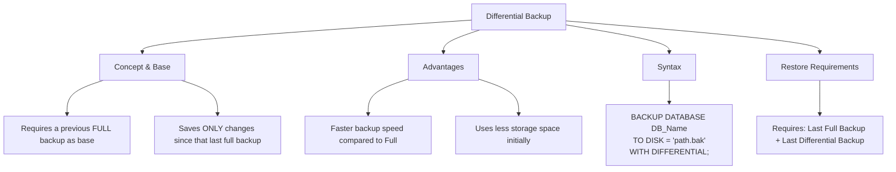

# Lesson 50 - SQL Differential Backup

---

# Introduction

In this lesson, we learned about:

**Differential Database Backup**

How to optimize backup time and storage by backing up only the data that has changed since the last Full Database Backup.

---

# What is a Differential Backup?

A **Differential Backup** is a type of backup that copies only the data that has changed since the last **Full Backup**.

The last Full Backup acts as the **Differential Base**.

As more changes are made to the database, subsequent Differential Backups will contain more changed data and therefore become larger.

When a new Full Backup is performed, the Differential Base is reset.

---

# Full vs. Differential Backup

| Feature                  | Full Backup                  | Differential Backup                           |
| :----------------------- | :--------------------------- | :-------------------------------------------- |
| **Data Saved**           | The entire database          | Only changes since the last Full Backup       |
| **Backup Time**          | Slower, depending on DB size | Usually faster                                |
| **Storage Size**         | Large                        | Smaller initially, grows over time            |
| **Restore Requirements** | Full Backup                  | Last Full Backup + latest Differential Backup |

---

# Differential Backup Mind Map

Below is a visual overview of SQL Differential Backup concepts:



---

# SQL Differential Backup Syntax (SQL Server)

To perform a Differential Backup in Microsoft SQL Server, we use the `BACKUP DATABASE` statement with the `WITH DIFFERENTIAL` option.

### Syntax

```sql id="9n4j2c"
BACKUP DATABASE database_name
TO DISK = 'filepath.bak'
WITH DIFFERENTIAL;
```

The `WITH DIFFERENTIAL` option tells SQL Server to create a Differential Backup instead of a Full Backup.

---

# Complete Example

First, we need to have a Full Backup of the database.

### Step 1: Create a Full Backup

```sql id="7f4k2m"
BACKUP DATABASE DB1
TO DISK = 'C:\DB1_Full.bak';
```

This Full Backup becomes the **Differential Base**.

### Step 2: Create a Differential Backup

After some changes are made to the database:

```sql id="1x8v5p"
BACKUP DATABASE DB1
TO DISK = 'C:\DB1_Differential.bak'
WITH DIFFERENTIAL;
```

The Differential Backup contains the changes made since the last Full Backup.

> **Important:** A Differential Backup requires a previous Full Backup of the same database. If the database has never had a Full Backup, SQL Server cannot create a Differential Backup.

---

# How Differential Backup Works

Suppose we create a Full Backup on Sunday.

```text id="q6c1aa"
Sunday
   ↓
Full Backup
   ↓
Differential Base
```

Then changes are made during the following days.

```text id="h1t7yd"
Monday
   ↓
Differential Backup
   ↓
Monday's changes

Tuesday
   ↓
Differential Backup
   ↓
Monday + Tuesday's changes

Wednesday
   ↓
Differential Backup
   ↓
Monday + Tuesday + Wednesday's changes
```

Each Differential Backup is based on the same Full Backup until a new Full Backup is created.

---

# Important Considerations & Best Practices

## 1. Cumulative Nature

A Differential Backup is **cumulative**.

For example, if we take a Full Backup on Sunday:

```text
Sunday → Full Backup
```

Then:

```text
Monday → Monday's changes
Tuesday → Monday + Tuesday's changes
Wednesday → Monday + Tuesday + Wednesday's changes
```

This means we do **not** need to restore every Differential Backup.

We only need the latest Differential Backup together with the corresponding Full Backup.

---

## 2. Recovery Plan

When a disaster occurs and we want to restore the database to its latest state using Differential Backups, we generally need:

### 1. The Last Full Backup

```sql id="cbhpxe"
RESTORE DATABASE DB1
FROM DISK = 'C:\DB1_Full.bak'
WITH NORECOVERY;
```

### 2. The Most Recent Differential Backup

```sql id="2h6w8r"
RESTORE DATABASE DB1
FROM DISK = 'C:\DB1_Differential.bak'
WITH RECOVERY;
```

The `NORECOVERY` option keeps the database in a restoring state so that another backup can be applied.

The `RECOVERY` option completes the restore process and brings the database online.

Intermediate Differential Backups do not need to be restored.

---

## 3. Storage Optimization

A common strategy is to schedule:

* **Full Backups** → Weekly
* **Differential Backups** → Daily

For example:

```text
Sunday
  ↓
Full Backup

Monday
  ↓
Differential Backup

Tuesday
  ↓
Differential Backup

Wednesday
  ↓
Differential Backup

Thursday
  ↓
Differential Backup

Friday
  ↓
Differential Backup

Saturday
  ↓
Differential Backup
```

This can reduce the backup time and storage requirements compared with taking a Full Backup every day.

---

# Before and After

### Full Backup

```text id="j8m4xk"
DB1
│
├── Original Data
└── Full Backup
```

### Data Changes

```text id="2q4w8f"
DB1
│
├── Original Data
└── New Changes
```

### Differential Backup

```sql id="y8bq2p"
BACKUP DATABASE DB1
TO DISK = 'C:\DB1_Differential.bak'
WITH DIFFERENTIAL;
```

The Differential Backup contains the changes made since the last Full Backup.

---

# Important SQL Server Command

The main SQL Server command for creating a Differential Backup is:

```sql id="c3s6pa"
BACKUP DATABASE database_name
TO DISK = 'filepath.bak'
WITH DIFFERENTIAL;
```

### Example

```sql id="j0m2vn"
BACKUP DATABASE DB1
TO DISK = 'C:\DB1_Differential.bak'
WITH DIFFERENTIAL;
```

---

# Key Takeaway

A Differential Backup stores the changes made since the last Full Backup.

To create one in SQL Server, use:

```sql id="6x7k3q"
BACKUP DATABASE database_name
TO DISK = 'filepath.bak'
WITH DIFFERENTIAL;
```

Remember:

* A Full Backup is required first.
* Differential Backups are cumulative.
* Each Differential Backup is based on the latest Full Backup.
* For restoration, use the corresponding Full Backup and the latest Differential Backup.
* Regular Full and Differential Backups can help balance backup time and storage usage.

---

# Summary

| Operation           | SQL Server                              |
| ------------------- | --------------------------------------- |
| Differential Backup | `BACKUP DATABASE ... WITH DIFFERENTIAL` |
| Differential Base   | Last Full Backup                        |
| Contains            | Changes since the last Full Backup      |
| Restore Requirement | Last Full + Latest Differential         |
| Common Schedule     | Weekly Full + Daily Differential        |

---

# Author

**Youness Chergui Amin**

---

<p align="center"><strong>Moroccan Arabic Version — النسخة بالدارجة المغربية</strong></p>

<div dir="rtl" align="right">

# الدرس 50 — SQL Differential Backup

---

# المقدمة

فهاد الدرس تعلمنا:

**Differential Database Backup**

كيفاش نحسنو وقت الـBackup وStorage باستعمال Backup كيدير غير للـData اللي تبدلات من بعد آخر **Full Database Backup**.

---

# شنو هو Differential Backup؟

الـ**Differential Backup** هو واحد النوع ديال الـBackup اللي كينسخ غير الـData اللي تبدلات من بعد آخر **Full Backup**.

آخر Full Backup كيسمى **Differential Base**.

كلما دازت الوقت ووقعات تغييرات جديدة فالـDatabase، الـDifferential Backups اللي من بعد غادي يكبرو حيث غادي يحتوي كل واحد منهم على تغييرات أكثر.

ملي كنديرو Full Backup جديد، الـDifferential Base كيتعاود يتحدد من جديد.

---

# Full vs. Differential Backup

| الخاصية                  | Full Backup              | Differential Backup                           |
| :----------------------- | :----------------------- | :-------------------------------------------- |
| **Data Saved**           | الـDatabase كاملة        | غير التغييرات من بعد آخر Full Backup          |
| **Backup Time**          | أبطأ حسب حجم الـDatabase | غالباً أسرع                                   |
| **Storage Size**         | كبير                     | صغير فالأول وكيكبر مع الوقت                   |
| **Restore Requirements** | Full Backup              | Last Full Backup + Latest Differential Backup |

---

# Differential Backup Mind Map

هاد الـMind Map كتعطي نظرة عامة على مفاهيم SQL Differential Backup:


---

# SQL Differential Backup Syntax — SQL Server

باش نديرو Differential Backup فـMicrosoft SQL Server، كنستعملو `BACKUP DATABASE` مع `WITH DIFFERENTIAL`.

### Syntax

```sql id="n7m2ca"
BACKUP DATABASE database_name
TO DISK = 'filepath.bak'
WITH DIFFERENTIAL;
```

الـ`WITH DIFFERENTIAL` كتقول لـSQL Server بلي بغينا نديرو Differential Backup وماشي Full Backup.

---

# Complete Example

أول حاجة، خاص يكون عندنا Full Backup ديال الـDatabase.

### Step 1: Create a Full Backup

```sql id="x5r8nd"
BACKUP DATABASE DB1
TO DISK = 'C:\DB1_Full.bak';
```

هاد Full Backup غادي يكون هو **Differential Base**.

### Step 2: Create a Differential Backup

من بعد ما توقع شي تغييرات فالـDatabase:

```sql id="p4y1vs"
BACKUP DATABASE DB1
TO DISK = 'C:\DB1_Differential.bak'
WITH DIFFERENTIAL;
```

الـDifferential Backup غادي يحتوي على التغييرات اللي وقعات من بعد آخر Full Backup.

> **Important:** خاص يكون عندنا Full Backup سابق ديال نفس الـDatabase باش نقدروا نديرو Differential Backup. إلا ما كانش عندنا Full Backup من قبل، SQL Server ما غاديش يقدر ينشئ Differential Backup.

---

# كيفاش كيخدم Differential Backup

نفترضو درنا Full Backup نهار الأحد:

```text id="f0q7we"
Sunday
   ↓
Full Backup
   ↓
Differential Base
```

ومن بعد بدات تغييرات كتوقع فالأيام اللي من بعد:

```text id="z2c8km"
Monday
   ↓
Differential Backup
   ↓
Monday's changes

Tuesday
   ↓
Differential Backup
   ↓
Monday + Tuesday's changes

Wednesday
   ↓
Differential Backup
   ↓
Monday + Tuesday + Wednesday's changes
```

كل Differential Backup كيبقى معتمد على نفس Full Backup حتى نديرو Full Backup جديد.

---

# Important Considerations & Best Practices

## 1. Cumulative Nature

الـDifferential Backup هو **Cumulative**.

مثلاً، إلا درنا Full Backup نهار الأحد:

```text
Sunday → Full Backup
```

ومن بعد:

```text
Monday → Monday's changes
Tuesday → Monday + Tuesday's changes
Wednesday → Monday + Tuesday + Wednesday's changes
```

يعني ما محتاجينش نرجعو كل Differential Backup بوحدو.

غير كنحتاجو آخر Differential Backup مع Full Backup اللي كيمثل الـBase ديالو.

---

## 2. Recovery Plan

إلا وقع Disaster وبغينا نرجعو الـDatabase لآخر حالة باستعمال Differential Backups، بشكل عام كنحتاجو:

### 1. Last Full Backup

```sql id="e4j9tq"
RESTORE DATABASE DB1
FROM DISK = 'C:\DB1_Full.bak'
WITH NORECOVERY;
```

### 2. Most Recent Differential Backup

```sql id="r8x3lm"
RESTORE DATABASE DB1
FROM DISK = 'C:\DB1_Differential.bak'
WITH RECOVERY;
```

الـ`NORECOVERY` كتخلي الـDatabase فـRestoring State باش نقدروا نطبقو Backup آخر.

والـ`RECOVERY` كتكمل عملية الـRestore وكتخلي الـDatabase ترجع Online.

الـIntermediate Differential Backups ما محتاجينش نرجعوهم.

---

## 3. Storage Optimization

واحد الـStrategy المشهورة هي نديرو:

* **Full Backups** → كل أسبوع
* **Differential Backups** → كل نهار

مثلاً:

```text
Sunday
  ↓
Full Backup

Monday
  ↓
Differential Backup

Tuesday
  ↓
Differential Backup

Wednesday
  ↓
Differential Backup

Thursday
  ↓
Differential Backup

Friday
  ↓
Differential Backup

Saturday
  ↓
Differential Backup
```

هاد الطريقة تقدر تنقص من وقت الـBackup ومن Storage مقارنة مع أننا نديرو Full Backup كل نهار.

---

# Before and After

### Full Backup

```text id="c9m1za"
DB1
│
├── Original Data
└── Full Backup
```

### Data Changes

```text id="v6k3qp"
DB1
│
├── Original Data
└── New Changes
```

### Differential Backup

```sql id="q2w7hf"
BACKUP DATABASE DB1
TO DISK = 'C:\DB1_Differential.bak'
WITH DIFFERENTIAL;
```

الـDifferential Backup غادي يحتوي على التغييرات اللي وقعات من بعد آخر Full Backup.

---

# Important SQL Server Command

الأمر الأساسي فـSQL Server باش نديرو Differential Backup هو:

```sql id="m5z8cn"
BACKUP DATABASE database_name
TO DISK = 'filepath.bak'
WITH DIFFERENTIAL;
```

### مثال

```sql id="t7p3bx"
BACKUP DATABASE DB1
TO DISK = 'C:\DB1_Differential.bak'
WITH DIFFERENTIAL;
```

---

# Key Takeaway

الـDifferential Backup كيخزن التغييرات اللي وقعات من بعد آخر Full Backup.

باش نديروه فـSQL Server، كنستعملو:

```sql id="k4v9sd"
BACKUP DATABASE database_name
TO DISK = 'filepath.bak'
WITH DIFFERENTIAL;
```

خاصنا نتفكرو:

* خاص Full Backup يكون دار قبل.
* Differential Backups هما Cumulative.
* كل Differential Backup كيعتمد على آخر Full Backup.
* فالـRestore، كنحتاجو الـFull Backup المناسب وآخر Differential Backup.
* تنظيم Full وDifferential Backups بشكل منتظم يقدر يساعدنا نوازنو بين Backup Time وStorage Usage.

---

# Summary

| العملية             | SQL Server                              |
| ------------------- | --------------------------------------- |
| Differential Backup | `BACKUP DATABASE ... WITH DIFFERENTIAL` |
| Differential Base   | Last Full Backup                        |
| Contains            | Changes since the last Full Backup      |
| Restore Requirement | Last Full + Latest Differential         |
| Common Schedule     | Weekly Full + Daily Differential        |

---

# Author

**Youness Chergui Amin**

</div>
