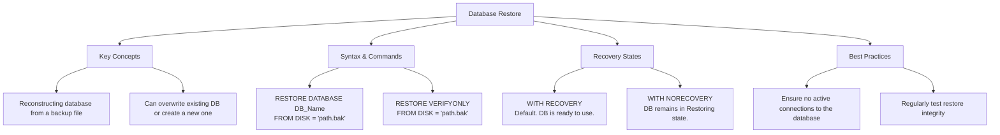

# Lesson 51 - SQL Restore Database

---

# Introduction

In this lesson, we learned about:

**Restoring a SQL Database**

How to reconstruct a database from a previously created backup file (`.bak`) to recover from data loss, corruption, or to create a copy of a database.

---

# What is SQL Database Restore?

Database restoration is the process of reconstructing a database from a previously created backup.

During the restore process, SQL Server restores the database data and log information from the backup and can apply additional backup files, such as Differential or Transaction Log Backups, to bring the database to a consistent state.

Restoring is an important test of a backup strategy.

Without a working restore process, backups cannot provide reliable recovery.

---

# Database Restore Mind Map

Below is a visual overview of SQL Database Restore concepts, syntax, recovery states, and best practices:



---

# SQL Restore Database Syntax (SQL Server)

To restore a database in Microsoft SQL Server, we use the `RESTORE DATABASE` statement.

## 1. Basic Restore (Default)

A Basic Restore restores the database from a backup file and makes it available for use.

SQL Server uses `WITH RECOVERY` by default when no recovery option is specified.

### Syntax

```sql id="m7r4px"
RESTORE DATABASE database_name
FROM DISK = 'filepath.bak';
```

---

## 2. Restore with NORECOVERY

`NORECOVERY` is used when we have additional backups to restore, such as Differential Backups or Transaction Log Backups.

The database remains in a **Restoring** state and is not available for normal use until the restore sequence is completed.

### Syntax

```sql id="g5c8vn"
RESTORE DATABASE database_name
FROM DISK = 'full_backup.bak'
WITH NORECOVERY;
```

After that, another backup can be applied.

---

# Recovery States

SQL Server provides different recovery options when restoring backups.

## 1. WITH RECOVERY

`WITH RECOVERY` completes the restore process.

The database becomes available for normal use, and no additional backups can be applied to that restore sequence.

### Example

```sql id="d8p2ka"
RESTORE DATABASE DB1
FROM DISK = 'C:\DB1.bak'
WITH RECOVERY;
```

---

## 2. WITH NORECOVERY

`WITH NORECOVERY` keeps the database in a Restoring state.

This allows additional backups to be restored afterward.

### Example

```sql id="v4n7sy"
RESTORE DATABASE DB1
FROM DISK = 'C:\DB1_Full.bak'
WITH NORECOVERY;
```

Then we can restore a Differential Backup:

```sql id="q6h3wm"
RESTORE DATABASE DB1
FROM DISK = 'C:\DB1_Differential.bak'
WITH RECOVERY;
```

---

# Complete Example

First, we need a previously created backup file.

Suppose we have:

```text id="z8m1qc"
C:\DB1.bak
```

We can restore the database using:

```sql id="f3x7ka"
RESTORE DATABASE DB1
FROM DISK = 'C:\DB1.bak';
```

This restores `DB1` and makes it available for use.

We can then verify the restored database:

```sql id="r9v5jd"
SELECT *
FROM DB1.dbo.Employees;
```

---

# Restore with Full + Differential Backup

Suppose we have:

```text id="k4w8nb"
C:\DB1_Full.bak
C:\DB1_Differential.bak
```

First, restore the Full Backup using `NORECOVERY`:

```sql id="x2c6vp"
RESTORE DATABASE DB1
FROM DISK = 'C:\DB1_Full.bak'
WITH NORECOVERY;
```

Then restore the latest Differential Backup:

```sql id="n7q3la"
RESTORE DATABASE DB1
FROM DISK = 'C:\DB1_Differential.bak'
WITH RECOVERY;
```

The database is now restored to the state represented by the latest Differential Backup.

---

# Important Considerations & Best Practices

## 1. Exclusive Access Required

SQL Server requires exclusive access to the database during a restore.

If there are active connections to the database, the restore operation may fail or wait until those connections are closed.

You can force existing connections to close by setting the database to Single-User mode:

```sql id="c5j9rx"
ALTER DATABASE DB1
SET SINGLE_USER
WITH ROLLBACK IMMEDIATE;

-- Run RESTORE command here

ALTER DATABASE DB1
SET MULTI_USER;
```

`WITH ROLLBACK IMMEDIATE` terminates active transactions and disconnects users immediately.

---

## 2. Verify Backup Integrity First

You can check whether a backup file is valid and readable without actually restoring the database.

Use:

```sql id="a8v4mt"
RESTORE VERIFYONLY
FROM DISK = 'C:\DB1.bak';
```

This can help detect problems with the backup before starting a full restore.

---

## 3. File Relocation (WITH MOVE)

When restoring a database to another server or to a location where the original database file paths do not exist, you may need to use `WITH MOVE`.

This allows you to specify new locations for:

* `.mdf` → Database Data File
* `.ldf` → Transaction Log File

### Example

```sql id="w3k7fz"
RESTORE DATABASE DB1
FROM DISK = 'C:\DB1.bak'
WITH MOVE 'DB1' TO 'D:\SQLData\DB1.mdf',
     MOVE 'DB1_log' TO 'D:\SQLData\DB1_log.ldf';
```

The logical file names used with `MOVE` must match the logical names stored inside the backup.

---

# Before and After

### Before Restore

```text id="u6q2pa"
Backup File
└── C:\DB1.bak
```

### Restore Command

```sql id="j8s4nd"
RESTORE DATABASE DB1
FROM DISK = 'C:\DB1.bak';
```

### After Restore

```text id="m2v7kc"
DB1
│
├── Tables
├── Data
├── Views
└── Procedures
```

The database has been reconstructed from the backup file.

---

# Important SQL Server Commands

### Restore Database

```sql id="p4z8qw"
RESTORE DATABASE database_name
FROM DISK = 'filepath.bak';
```

### Restore with NORECOVERY

```sql id="y6c2mr"
RESTORE DATABASE database_name
FROM DISK = 'filepath.bak'
WITH NORECOVERY;
```

### Verify Backup

```sql id="n3k7vx"
RESTORE VERIFYONLY
FROM DISK = 'filepath.bak';
```

### Restore with MOVE

```sql id="s5h9ld"
RESTORE DATABASE database_name
FROM DISK = 'filepath.bak'
WITH MOVE 'logical_data_name' TO 'new_data_path.mdf',
     MOVE 'logical_log_name' TO 'new_log_path.ldf';
```

---

# Key Takeaway

To restore a SQL Server database from a backup file, use:

```sql id="b7x2nm"
RESTORE DATABASE database_name
FROM DISK = 'filepath.bak';
```

Remember:

* A valid backup file is required.
* The database may require exclusive access during restore.
* Use `NORECOVERY` when additional backups need to be applied.
* Use `RECOVERY` to complete the restore sequence.
* Use `RESTORE VERIFYONLY` to check a backup before restoring it.
* Use `WITH MOVE` when database files need to be restored to different locations.
* Always test your restore process regularly.

---

# Summary

| Operation                | SQL Server                   |
| ------------------------ | ---------------------------- |
| Restore Database         | `RESTORE DATABASE`           |
| Restore from Disk        | `FROM DISK = 'filepath.bak'` |
| Keep Database Restoring  | `WITH NORECOVERY`            |
| Complete Restore         | `WITH RECOVERY`              |
| Verify Backup            | `RESTORE VERIFYONLY`         |
| Move Database Files      | `WITH MOVE`                  |
| Require Exclusive Access | Single-User Mode             |

---

# Author

**Youness Chergui Amin**

---

<p align="center"><strong>Moroccan Arabic Version — النسخة بالدارجة المغربية</strong></p>

<div dir="rtl" align="right">

# الدرس 51 — SQL Restore Database

---

# المقدمة

فهاد الدرس تعلمنا:

**Restoring a SQL Database**

يعني كيفاش نرجعو Database باستعمال Backup File (`.bak`) سبق لينا درناه، باش نرجعو الـData من بعد Data Loss أو Corruption، أو باش نديرو Copy من Database.

---

# شنو هو SQL Database Restore؟

Database Restoration هي العملية اللي كنرجعو فيها Database باستعمال Backup سبق لينا أنشأناه.

أثناء عملية الـRestore، SQL Server كيرجع الـData والـLog Information من الـBackup، ويقدر يطبق Backups إضافية بحال Differential Backups أو Transaction Log Backups باش يوصل الـDatabase لحالة صحيحة ومتناسقة.

الـRestore هو واحد الاختبار مهم لأي Backup Strategy.

إلا ما كانش عندنا Restore Process خدام مزيان، الـBackups ما غاديش يعطيو Recovery موثوق.

---

# Database Restore Mind Map

هاد الـMind Map كتعطي نظرة عامة على مفاهيم SQL Database Restore، الـSyntax، Recovery States، وأفضل الممارسات:


---

# SQL Restore Database Syntax — SQL Server

باش نرجعو Database فـMicrosoft SQL Server، كنستعملو `RESTORE DATABASE`.

## 1. Basic Restore (Default)

الـBasic Restore كيرجع الـDatabase من Backup File وكيخليها متاحة للاستعمال.

SQL Server كتستعمل `WITH RECOVERY` بشكل افتراضي إلا ما حددناش Recovery Option أخرى.

### Syntax

```sql id="c8v5yr"
RESTORE DATABASE database_name
FROM DISK = 'filepath.bak';
```

---

## 2. Restore with NORECOVERY

كنستعملو `NORECOVERY` إلا كانو عندنا Backups إضافية خاصنا نرجعوهم، بحال Differential Backups أو Transaction Log Backups.

الـDatabase كتبقى فـ**Restoring State** وما كتكونش متاحة للاستعمال العادي حتى تكمل Restore Sequence.

### Syntax

```sql id="h2m7qx"
RESTORE DATABASE database_name
FROM DISK = 'full_backup.bak'
WITH NORECOVERY;
```

ومن بعد نقدروا نطبقو Backup آخر.

---

# Recovery States

SQL Server كتقدم لينا Recovery Options مختلفة أثناء Restore.

## 1. WITH RECOVERY

`WITH RECOVERY` كتكمل عملية الـRestore.

الـDatabase كتولي متاحة للاستعمال العادي، وما كيبقاش ممكن نطبقو Backups إضافية على نفس Restore Sequence.

### مثال

```sql id="v9k3fw"
RESTORE DATABASE DB1
FROM DISK = 'C:\DB1.bak'
WITH RECOVERY;
```

---

## 2. WITH NORECOVERY

`WITH NORECOVERY` كتخلي الـDatabase فـRestoring State.

هادشي كيسمح لينا نرجعو Backups إضافية من بعد.

### مثال

```sql id="q5x8na"
RESTORE DATABASE DB1
FROM DISK = 'C:\DB1_Full.bak'
WITH NORECOVERY;
```

ومن بعد نقدروا نرجعو Differential Backup:

```sql id="m4r7kc"
RESTORE DATABASE DB1
FROM DISK = 'C:\DB1_Differential.bak'
WITH RECOVERY;
```

---

# Complete Example

أولاً، خاصنا Backup File سبق لينا درناه.

نفترضو عندنا:

```text id="w6z2pd"
C:\DB1.bak
```

نقدرو نرجعو الـDatabase باستعمال:

```sql id="g8n4vt"
RESTORE DATABASE DB1
FROM DISK = 'C:\DB1.bak';
```

هاد الأمر كيرجع `DB1` وكيخليها متاحة للاستعمال.

ومن بعد نقدروا نتأكدو من الـDatabase اللي رجعات:

```sql id="r2m9xf"
SELECT *
FROM DB1.dbo.Employees;
```

---

# Restore with Full + Differential Backup

نفترضو عندنا:

```text id="p7k3yd"
C:\DB1_Full.bak
C:\DB1_Differential.bak
```

أولاً، كنرجعو Full Backup باستعمال `NORECOVERY`:

```sql id="x9c5mw"
RESTORE DATABASE DB1
FROM DISK = 'C:\DB1_Full.bak'
WITH NORECOVERY;
```

ومن بعد كنرجعو آخر Differential Backup:

```sql id="n4v8qa"
RESTORE DATABASE DB1
FROM DISK = 'C:\DB1_Differential.bak'
WITH RECOVERY;
```

دابا الـDatabase رجعات للحالة اللي كيمثلها آخر Differential Backup.

---

# Important Considerations & Best Practices

## 1. Exclusive Access Required

SQL Server كتحتاج Exclusive Access على الـDatabase أثناء عملية الـRestore.

إلا كانو Active Connections فالـDatabase، عملية الـRestore ممكن تفشل أو تبقى كتسنى حتى يتسدّو هاد Connections.

نقدرو نفرضو إغلاق الـConnections باستعمال Single-User Mode:

```sql id="a6q3vz"
ALTER DATABASE DB1
SET SINGLE_USER
WITH ROLLBACK IMMEDIATE;

-- Run RESTORE command here

ALTER DATABASE DB1
SET MULTI_USER;
```

`WITH ROLLBACK IMMEDIATE` كتوقف Active Transactions وكتقطع Connections ديال Users مباشرة.

---

## 2. Verify Backup Integrity First

نقدرو نتحققو واش Backup File صالح وكيقدر SQL Server يقراه، بلا ما نديرو Restore فعلي للـDatabase.

كنستعملو:

```sql id="f8m2jc"
RESTORE VERIFYONLY
FROM DISK = 'C:\DB1.bak';
```

هادشي يقدر يساعدنا نكتاشفو مشاكل فالـBackup قبل ما نبداو Full Restore.

---

## 3. File Relocation (WITH MOVE)

إلا كنا كنرجعو Database فـServer آخر أو فـFolder مختلف والـOriginal File Paths ما كايناش، ممكن نحتاجو `WITH MOVE`.

هاد Option كتسمح لينا نحددو Locations جديدة لـ:

* `.mdf` → Database Data File
* `.ldf` → Transaction Log File

### مثال

```sql id="k7p4xs"
RESTORE DATABASE DB1
FROM DISK = 'C:\DB1.bak'
WITH MOVE 'DB1' TO 'D:\SQLData\DB1.mdf',
     MOVE 'DB1_log' TO 'D:\SQLData\DB1_log.ldf';
```

الـLogical File Names اللي كنستعملو مع `MOVE` خاصهم يطابقو الـLogical Names المخزنين داخل الـBackup.

---

# Before and After

### قبل الـRestore

```text id="z5n8rm"
Backup File
└── C:\DB1.bak
```

### Restore Command

```sql id="u3q7kf"
RESTORE DATABASE DB1
FROM DISK = 'C:\DB1.bak';
```

### من بعد الـRestore

```text id="b9x2mc"
DB1
│
├── Tables
├── Data
├── Views
└── Procedures
```

الـDatabase رجعات من Backup File.

---

# Important SQL Server Commands

### Restore Database

```sql id="e6k3pa"
RESTORE DATABASE database_name
FROM DISK = 'filepath.bak';
```

### Restore with NORECOVERY

```sql id="r7m4vx"
RESTORE DATABASE database_name
FROM DISK = 'filepath.bak'
WITH NORECOVERY;
```

### Verify Backup

```sql id="t2q8nc"
RESTORE VERIFYONLY
FROM DISK = 'filepath.bak';
```

### Restore with MOVE

```sql id="j5v9sd"
RESTORE DATABASE database_name
FROM DISK = 'filepath.bak'
WITH MOVE 'logical_data_name' TO 'new_data_path.mdf',
     MOVE 'logical_log_name' TO 'new_log_path.ldf';
```

---

# Key Takeaway

باش نرجعو SQL Server Database من Backup File، كنستعملو:

```sql id="p8c4ym"
RESTORE DATABASE database_name
FROM DISK = 'filepath.bak';
```

خاصنا نتفكرو:

* خاص Backup File صالح.
* ممكن الـDatabase تحتاج Exclusive Access أثناء الـRestore.
* كنستعملو `NORECOVERY` إلا كانو Backups إضافية خاصنا نطبقوهم.
* كنستعملو `RECOVERY` باش نكملو Restore Sequence.
* كنستعملو `RESTORE VERIFYONLY` باش نتحققو من Backup قبل الـRestore.
* كنستعملو `WITH MOVE` إلا خاصنا نغيرو Locations ديال Database Files.
* خاصنا نجربو Restore Process بانتظام.

---

# Summary

| العملية                  | SQL Server                   |
| ------------------------ | ---------------------------- |
| Restore Database         | `RESTORE DATABASE`           |
| Restore from Disk        | `FROM DISK = 'filepath.bak'` |
| Keep Database Restoring  | `WITH NORECOVERY`            |
| Complete Restore         | `WITH RECOVERY`              |
| Verify Backup            | `RESTORE VERIFYONLY`         |
| Move Database Files      | `WITH MOVE`                  |
| Require Exclusive Access | Single-User Mode             |

---

# Author

**Youness Chergui Amin**

</div>
