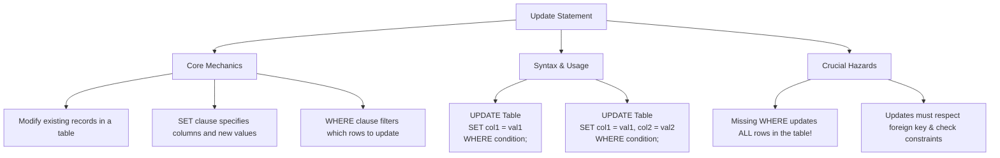

# Lesson 53 - SQL Update Statement

## Introduction

In this lesson, we learned about:

**The UPDATE Statement**

How to modify existing records in a database table. We explored how to update a single column, how to update multiple columns simultaneously, and the critical importance of using the `WHERE` clause to target specific records.

---

# What is the SQL UPDATE Statement?

The `UPDATE` statement is a Data Manipulation Language (DML) command used to edit or change existing data in a table.

Unlike the `INSERT INTO` statement, which adds completely new rows, or the `DELETE` statement, which removes rows, the `UPDATE` statement modifies existing fields within specified records.

---

# UPDATE Statement Mind Map

Below is a visual overview of SQL `UPDATE` concepts, syntax patterns, and safety practices:



---

# SQL UPDATE Syntax (SQL Server)

To update records in a table, you use the `UPDATE` statement combined with the `SET` and `WHERE` clauses.

## 1. Updating a Single Column for Specific Rows

Changes the value in a single column for all rows matching the criteria.

```sql
UPDATE table_name
SET column1 = new_value1
WHERE condition;
```

## 2. Updating Multiple Columns for a Specific Row

Updates multiple fields at once by separating assignments with a comma.

```sql
UPDATE table_name
SET column1 = new_value1,
    column2 = new_value2,
    column3 = new_value3
WHERE condition;
```

---

# Complete Example

Refer to `SQLQuery6.sql` for the SQL query applied in this lesson.

## 1. Updating a Single Column

Setting salary to `500` for employees with salary less than `50,000`:

```sql
UPDATE Employees
SET Salary = 500
WHERE Salary < 50000;
```

## 2. Updating Multiple Columns for a Single Employee

Updating the name and salary for Employee ID `2`:

```sql
UPDATE Employees
SET FirstName = 'Youness',
    LastName = 'Chergui',
    Salary = 60000
WHERE EmployeeID = 2;
```

---

# Important Considerations & Best Practices

## 1. The Danger of Missing the WHERE Clause

If you omit the `WHERE` clause in an `UPDATE` statement, **every single record** in the table will be updated with the new values.

This is one of the most common and critical mistakes when working with databases.

```sql
-- DANGER: This will make everyone's salary 1,000,000!

UPDATE Employees
SET Salary = 1000000;
```

Always double-check your `WHERE` clause before executing an `UPDATE` statement.

---

## 2. Verify Before Updating

A good practice is to write a `SELECT` statement with the exact same `WHERE` clause first.

Once you verify that the selected records are correct, change the statement to an `UPDATE`.

```sql
-- Step 1: Verify the rows
SELECT * FROM Employees WHERE EmployeeID = 2;

-- Step 2: Safe Update
UPDATE Employees
SET Salary = 60000
WHERE EmployeeID = 2;
```

---

## 3. Transaction Protection

For dangerous updates, you can wrap them in a transaction so you can roll them back if something goes wrong.

```sql
BEGIN TRANSACTION;

UPDATE Employees
SET Salary = 55000
WHERE Department = 'IT';

-- If it looks correct:
COMMIT;

-- If there's an error:
ROLLBACK;
```

---

# Key Takeaway

The `UPDATE` statement is used to modify existing data in a table.

The basic structure is:

```sql
UPDATE table_name
SET column1 = new_value
WHERE condition;
```

The `WHERE` clause is especially important because without it, all rows in the table can be updated.

---

# Summary

| Concept                  | Description                                   |
| ------------------------ | --------------------------------------------- |
| `UPDATE`                 | Modifies existing data                        |
| `SET`                    | Specifies the new values                      |
| `WHERE`                  | Specifies which rows to update                |
| Single Column            | Updates one column                            |
| Multiple Columns         | Updates several columns                       |
| Missing `WHERE`          | Updates all rows                              |
| `SELECT` Before `UPDATE` | Helps verify the target rows                  |
| Transaction              | Allows changes to be committed or rolled back |

---

# Author

**Youness Chergui Amin**

---

<p align="center"><strong>Moroccan Arabic Version — النسخة بالدارجة المغربية</strong></p>

<div dir="rtl" align="right">

# الدرس 53 - SQL Update Statement

## المقدمة

فهاد الدرس تعلمنا:

**UPDATE Statement**

كيفاش نعدلو على الـRecords الموجودة من قبل داخل واحد الـTable. وتعلمنا كيفاش نعدلو Column وحدة، وكيفاش نعدلو عدة Columns فـنفس الوقت، وأهمية استعمال `WHERE` باش نحددو الـRecords اللي بغينا نعدلو.

---

# شنو هي SQL UPDATE Statement؟

الـ `UPDATE` هي واحد الأمر من **Data Manipulation Language (DML)**، وكتستعمل باش نعدلو أو نبدلو البيانات الموجودة داخل Table.

على عكس `INSERT INTO` اللي كتزيد Rows جداد، و `DELETE` اللي كتحيد Rows، الـ `UPDATE` كتعدل على البيانات الموجودة داخل الـRecords.

---

# UPDATE Statement Mind Map

هاد الـMind Map كتعطي نظرة عامة على مفاهيم `UPDATE` والـSyntax والمخاطر المهمة:


---

# SQL UPDATE Syntax (SQL Server)

باش نعدلو على Records فـTable، كنستعملو `UPDATE` مع `SET` و `WHERE`.

## 1. تعديل Column وحدة لRows محددين

كتبدل القيمة ديال Column وحدة لجميع الـRows اللي كيتوافقو مع الـCondition.

```sql
UPDATE table_name
SET column1 = new_value1
WHERE condition;
```

## 2. تعديل عدة Columns لRow محدد

نقدرو نعدلو عدة Fields فـنفس الوقت، وكنفصلو بينهم بـComma.

```sql
UPDATE table_name
SET column1 = new_value1,
    column2 = new_value2,
    column3 = new_value3
WHERE condition;
```

---

# Complete Example

الـSQL Query اللي تطبق فهاد الدرس موجودة فـ`SQLQuery6.sql`.

## 1. تعديل Column وحدة

تغيير الـSalary إلى `500` للموظفين اللي الـSalary ديالهم أقل من `50,000`:

```sql
UPDATE Employees
SET Salary = 500
WHERE Salary < 50000;
```

## 2. تعديل عدة Columns لموظف واحد

تعديل الاسم والـSalary ديال الموظف اللي عندو `EmployeeID = 2`:

```sql
UPDATE Employees
SET FirstName = 'Youness',
    LastName = 'Chergui',
    Salary = 60000
WHERE EmployeeID = 2;
```

---

# Important Considerations & Best Practices

## 1. الخطر ديال نساو WHERE

إلا ماكتبناش `WHERE` فـ`UPDATE`، **جميع الـRecords** اللي فالـTable غادي يتعدلو بالقيم الجديدة.

وهذا من الأخطاء المهمة والخطيرة فالتعامل مع قواعد البيانات.

```sql
-- DANGER: This will make everyone's salary 1,000,000!

UPDATE Employees
SET Salary = 1000000;
```

دائماً خاصنا نتأكدو من `WHERE` قبل ما ننفذو `UPDATE`.

---

## 2. Verify Before Updating

من الأحسن قبل `UPDATE` نديرو `SELECT` بنفس الـ`WHERE` باش نتأكدو بالضبط من الـRows اللي غادي يتعدلو.

```sql
-- Step 1: Verify the rows
SELECT * FROM Employees WHERE EmployeeID = 2;

-- Step 2: Safe Update
UPDATE Employees
SET Salary = 60000
WHERE EmployeeID = 2;
```

---

## 3. Transaction Protection

فـUpdates اللي ممكن تكون خطيرة، نقدروا نستعملو Transaction باش نقدروا نرجعو التغييرات إلا وقع شي مشكل.

```sql
BEGIN TRANSACTION;

UPDATE Employees
SET Salary = 55000
WHERE Department = 'IT';

-- If it looks correct:
COMMIT;

-- If there's an error:
ROLLBACK;
```

---

# Key Takeaway

الـ `UPDATE` كتستعمل باش نعدلو البيانات الموجودة من قبل داخل Table.

الـStructure الأساسي هو:

```sql
UPDATE table_name
SET column1 = new_value
WHERE condition;
```

والـ`WHERE` مهمة بزاف، حيث إلا حيدناها ممكن يتعدلو جميع الـRows ديال الـTable.

---

# Summary

| المفهوم                  | الشرح                               |
| ------------------------ | ----------------------------------- |
| `UPDATE`                 | كتعدل البيانات الموجودة             |
| `SET`                    | كتحدد القيم الجديدة                 |
| `WHERE`                  | كتحدد الـRows اللي غادي يتعدلو      |
| Single Column            | تعديل Column وحدة                   |
| Multiple Columns         | تعديل عدة Columns                   |
| Missing `WHERE`          | كيعدل جميع الـRows                  |
| `SELECT` Before `UPDATE` | كتعاوننا نتأكدو من الـRows          |
| Transaction              | كتسمح لينا نديرو Commit أو Rollback |

---

# Author

**Youness Chergui Amin**

</div>
