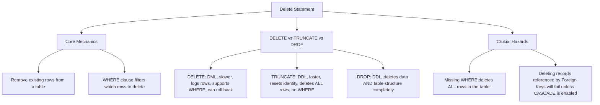

# Lesson 54 - SQL Delete Statement

## Introduction

In this lesson, we learned about:

**The DELETE Statement**

How to remove existing records from a database table. We explored how to delete specific rows using the `WHERE` clause, the critical importance of filtering, and the key differences between `DELETE`, `TRUNCATE`, and `DROP` commands.

---

# What is the SQL DELETE Statement?

The `DELETE` statement is a Data Manipulation Language (DML) command used to remove one or more existing records from a table.

Unlike the `DROP` statement, which deletes the entire table structure, or the `UPDATE` statement, which modifies existing values, the `DELETE` statement removes entire rows while keeping the table structure, columns, and constraints intact.

---

# DELETE Statement Mind Map

Below is a visual overview of SQL `DELETE` concepts, syntax patterns, and safety practices:



---

# SQL DELETE Syntax (SQL Server)

To delete records from a table, you use the `DELETE FROM` statement combined with the `WHERE` clause.

## 1. Deleting Specific Rows

Removes only the rows that match the condition in the `WHERE` clause.

```sql
DELETE FROM table_name
WHERE condition;
```

## 2. Deleting All Rows (Keep Structure)

Removes all records from the table but keeps the structure, columns, and indexes.

```sql
DELETE FROM table_name;
```

---

# Complete Example

Refer to `SQLQuery7.sql` for the SQL query applied in this lesson.

## Deleting a Specific Record

For example, deleting the employee with `EmployeeID = 9`:

```sql
DELETE FROM Employees
WHERE EmployeeID = 9;

SELECT * FROM Employees;
```

---

# Comparison: DELETE vs. TRUNCATE vs. DROP

| Feature            | DELETE                                             | TRUNCATE                                      | DROP                                   |
| ------------------ | -------------------------------------------------- | --------------------------------------------- | -------------------------------------- |
| **Command Type**   | DML (Data Manipulation Language)                   | DDL (Data Definition Language)                | DDL (Data Definition Language)         |
| **WHERE Clause**   | Supported (can delete specific rows)               | Not supported (deletes all rows)              | Not supported (deletes whole table)    |
| **Speed**          | Slower (deletes row-by-row and logs each deletion) | Faster (deallocates pages, logs minimal data) | Fastest (removes the table completely) |
| **Identity Reset** | Does **NOT** reset the identity seed               | Resets the identity seed                      | Table structure is deleted entirely    |
| **Rollback**       | Can be rolled back inside a transaction            | Can be rolled back (in SQL Server)            | Can be rolled back (in SQL Server)     |
| **Triggers**       | Fires DELETE triggers                              | Does not fire triggers                        | Does not fire triggers                 |

---

# Important Considerations & Best Practices

## 1. The Danger of Missing the WHERE Clause

If you omit the `WHERE` clause in a `DELETE` statement, **every single record** in the table will be deleted.

Always double-check your `WHERE` clause before executing a `DELETE` statement.

```sql
-- DANGER: This will delete ALL employees!

DELETE FROM Employees;
```

---

## 2. Verify Before Deleting

Always run a `SELECT` query with the exact same `WHERE` condition to confirm which records will be affected before executing the `DELETE` command.

```sql
-- Step 1: Verify the rows to be deleted
SELECT * FROM Employees
WHERE Salary < 3000 AND Department = 'Marketing';

-- Step 2: Safe Delete
DELETE FROM Employees
WHERE Salary < 3000 AND Department = 'Marketing';
```

---

## 3. Transaction Protection

Wrap your delete commands in a transaction to verify the number of affected rows before committing.

```sql
BEGIN TRANSACTION;

DELETE FROM Employees
WHERE Active = 0;

-- If the number of affected rows matches your expectation:
COMMIT;

-- If too many or incorrect rows were affected:
ROLLBACK;
```

---

# Key Takeaway

The `DELETE` statement is used to remove existing rows from a table.

The basic syntax is:

```sql
DELETE FROM table_name
WHERE condition;
```

The `WHERE` clause is extremely important because without it, all rows in the table can be deleted.

---

# Summary

| Concept                  | Description                                        |
| ------------------------ | -------------------------------------------------- |
| `DELETE`                 | Removes existing rows                              |
| `WHERE`                  | Specifies which rows to delete                     |
| `DELETE FROM table_name` | Deletes all rows while keeping the table structure |
| `TRUNCATE`               | Deletes all rows and resets the identity seed      |
| `DROP`                   | Deletes the table and its structure                |
| Missing `WHERE`          | Deletes all rows                                   |
| `SELECT` Before `DELETE` | Helps verify the rows                              |
| Transaction              | Allows changes to be committed or rolled back      |

---

# Author

**Youness Chergui Amin**

---

<p align="center"><strong>Moroccan Arabic Version — النسخة بالدارجة المغربية</strong></p>

<div dir="rtl" align="right">

# الدرس 54 - SQL Delete Statement

## المقدمة

فهاد الدرس تعلمنا:

**DELETE Statement**

كيفاش نحيدو الـRecords الموجودة من قبل من واحد الـTable. وتعلمنا كيفاش نحيدو Rows محددين باستعمال `WHERE`، وأهمية الـFiltering، والفرق بين `DELETE` و `TRUNCATE` و `DROP`.

---

# شنو هي SQL DELETE Statement؟

الـ `DELETE` هي واحد الأمر من **Data Manipulation Language (DML)**، وكتستعمل باش نحيدو واحد أو أكثر من الـRecords الموجودة داخل Table.

على عكس `DROP` اللي كتحيد الـTable كاملة بالـStructure ديالها، و `UPDATE` اللي كتعدل القيم الموجودة، الـ `DELETE` كتحيد الـRows كاملة مع بقاء الـTable والـColumns والـConstraints ديالها.

---

# DELETE Statement Mind Map

هاد الـMind Map كتعطي نظرة عامة على مفاهيم `DELETE` والـSyntax والمخاطر المهمة:


---

# SQL DELETE Syntax (SQL Server)

باش نحيدو Records من واحد الـTable، كنستعملو `DELETE FROM` مع `WHERE`.

## 1. حذف Rows محددين

كيحيد غير الـRows اللي كيتوافقو مع الـCondition الموجودة فـ`WHERE`.

```sql
DELETE FROM table_name
WHERE condition;
```

## 2. حذف جميع الـRows مع الحفاظ على الـStructure

كيحيد جميع الـRecords من الـTable، ولكن الـStructure والـColumns والـIndexes كيبقاو.

```sql
DELETE FROM table_name;
```

---

# Complete Example

الـSQL Query اللي تطبقات فهاد الدرس موجودة فـ`SQLQuery7.sql`.

## حذف Record محدد

مثلاً، نحيدو الموظف اللي عندو `EmployeeID = 9`:

```sql
DELETE FROM Employees
WHERE EmployeeID = 9;

SELECT * FROM Employees;
```

---

# Comparison: DELETE vs. TRUNCATE vs. DROP

| الخاصية            | DELETE                               | TRUNCATE                         | DROP                              |
| ------------------ | ------------------------------------ | -------------------------------- | --------------------------------- |
| **نوع الأمر**      | DML                                  | DDL                              | DDL                               |
| **WHERE Clause**   | مدعومة، نقدروا نحيدو Rows محددين     | ما مدعومـاش، كتحيد جميع Rows     | ما مدعومـاش، كتحيد الـTable كاملة |
| **السرعة**         | أبطأ                                 | أسرع                             | الأسرع                            |
| **Identity Reset** | ما كترجعش Identity Seed للصفر        | كترجع Identity Seed              | الـTable كاملة كتتحيد             |
| **Rollback**       | يمكن نديرو Rollback داخل Transaction | يمكن نديرو Rollback فـSQL Server | يمكن نديرو Rollback فـSQL Server  |
| **Triggers**       | كتخدم DELETE Triggers                | ما كتخدمش Triggers               | ما كتخدمش Triggers                |

---

# Important Considerations & Best Practices

## 1. الخطر ديال نساو WHERE

إلا ماكتبناش `WHERE` فـ`DELETE`، **جميع الـRecords** اللي فالـTable غادي يتحيدو.

دائماً خاصنا نتأكدو من `WHERE` قبل تنفيذ `DELETE`.

```sql
-- DANGER: This will delete ALL employees!

DELETE FROM Employees;
```

---

## 2. Verify Before Deleting

دائماً من الأحسن نديرو `SELECT` بنفس الـ`WHERE` باش نتأكدو شنو هما الـRecords اللي غادي يتحيدو قبل تنفيذ `DELETE`.

```sql
-- Step 1: Verify the rows to be deleted
SELECT * FROM Employees
WHERE Salary < 3000 AND Department = 'Marketing';

-- Step 2: Safe Delete
DELETE FROM Employees
WHERE Salary < 3000 AND Department = 'Marketing';
```

---

## 3. Transaction Protection

نقدرو نديرو `DELETE` داخل Transaction باش نتأكدو من عدد الـRows اللي تأثرو قبل ما نديرو `COMMIT`.

```sql
BEGIN TRANSACTION;

DELETE FROM Employees
WHERE Active = 0;

-- If the number of affected rows matches your expectation:
COMMIT;

-- If too many or incorrect rows were affected:
ROLLBACK;
```

---

# Key Takeaway

الـ `DELETE` كتستعمل باش نحيدو الـRows الموجودة من قبل من واحد الـTable.

الـSyntax الأساسي هو:

```sql
DELETE FROM table_name
WHERE condition;
```

والـ`WHERE` مهمة بزاف، حيث إلا ما استعملناهاش، ممكن يتحيدو جميع الـRows ديال الـTable.

---

# Summary

| المفهوم                  | الشرح                                    |
| ------------------------ | ---------------------------------------- |
| `DELETE`                 | كتحيد الـRows الموجودة                   |
| `WHERE`                  | كتحدد الـRows اللي غادي يتحيدو           |
| `DELETE FROM table_name` | كتحيد جميع الـRows مع بقاء الـTable      |
| `TRUNCATE`               | كتحيد جميع الـRows وكتعاود Identity Seed |
| `DROP`                   | كتحيد الـTable والـStructure ديالها      |
| Missing `WHERE`          | كيحيد جميع الـRows                       |
| `SELECT` Before `DELETE` | كتعاوننا نتأكدو من الـRows               |
| Transaction              | كتسمح لينا نديرو Commit أو Rollback      |

---

# Author

**Youness Chergui Amin**

</div>
