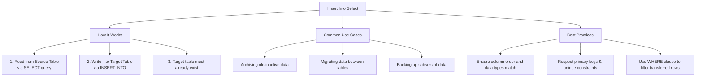

# Lesson 56 - SQL Insert Into Select Statement

## Introduction

In this lesson, we learned about:

**The INSERT INTO SELECT Statement**

This statement is used to copy data from one table and insert it into another existing table. It allows us to transfer records efficiently between tables without needing external scripts or intermediate data files.

---

# What is the SQL INSERT INTO SELECT Statement?

The `INSERT INTO SELECT` statement combines the query capabilities of `SELECT` with the insertion capabilities of `INSERT INTO`.

## Key Characteristics

* **Existing Target Table:** The target table must already exist in the database.
* **Data Type Matching:** The data types in the target table must match or be compatible with the source columns returned by the `SELECT` query.
* **Filtering & Criteria:** You can filter the records being copied using a `WHERE` clause in the `SELECT` statement.

---

# INSERT INTO SELECT Mind Map

Below is a visual overview of how the SQL `INSERT INTO SELECT` statement works and its common use cases:



---

# SQL INSERT INTO SELECT Syntax (SQL Server)

To insert data into a table from another table, you can use the following syntaxes.

## 1. Copying All Columns

Assuming the source and target table schemas match:

```sql id="7w9h5k"
INSERT INTO target_table
SELECT * FROM source_table
WHERE condition;
```

## 2. Copying Specific Columns

This is recommended for safety because it explicitly defines which columns are being copied.

```sql id="q2m8x1"
INSERT INTO target_table (column1, column2, column3)
SELECT column1, column2, column3
FROM source_table
WHERE condition;
```

---

# Complete Example

Refer to `SQLQuery2.sql` for the SQL query applied in this lesson.

## 1. Creating the Tables

Create the source table `oldperson`:

```sql id="1z6m4p"
CREATE TABLE oldperson (
    id INT PRIMARY KEY,
    name VARCHAR(255) NOT NULL,
    age INT NOT NULL
);
```

Create the target table `Person`:

```sql id="r8x3k2"
CREATE TABLE Person (
    id INT PRIMARY KEY,
    name VARCHAR(255) NOT NULL,
    age INT NOT NULL
);
```

---

## 2. Seeding the Source Table

Insert some data into the `oldperson` table:

```sql id="5h2q9v"
INSERT INTO oldperson (id, name, age)
VALUES
    (1, 'Yassine Amrani', 75),
    (2, 'Salma Bennani', 80),
    (3, 'Omar El Fassi', 85);
```

---

## 3. Copying Data Using INSERT INTO SELECT

Now we can copy the data from `oldperson` into `Person`:

```sql id="k6p1w8"
INSERT INTO Person
SELECT * FROM oldperson;
```

---

## 4. Verifying the Insertion

To verify the copied data:

```sql id="n4s7x2"
SELECT * FROM Person;
```

> **Note:** Unlike `SELECT INTO`, which creates a new table automatically, `INSERT INTO SELECT` requires the target table (`Person` in this case) to be created beforehand.

---

# Important Considerations & Best Practices

## 1. Constraints & Duplicates

Make sure you don't violate `PRIMARY KEY` or `UNIQUE` constraints in the target table when copying records.

If duplicate keys are inserted, the operation will fail.

---

## 2. NOT NULL Columns

If the target table has columns defined as `NOT NULL` and the source query returns `NULL`, or doesn't provide a value for those columns, the query will fail unless those columns have defined default values.

---

## 3. Subset Copying

Use the `WHERE` clause if you only want to archive or copy a subset of data.

For example:

```sql id="p3x8c5"
INSERT INTO Person (id, name, age)
SELECT id, name, age
FROM oldperson
WHERE age >= 80;
```

---

# Key Takeaway

`INSERT INTO SELECT` is used to copy data from an existing table into another existing table.

The target table must already exist, and the selected columns must be compatible with the target columns.

---

# Summary

| Concept                  | Description                                |
| ------------------------ | ------------------------------------------ |
| `INSERT INTO SELECT`     | Copies data from one table to another      |
| Target Table             | Must already exist                         |
| `SELECT`                 | Retrieves the source data                  |
| `INSERT INTO`            | Inserts the retrieved data                 |
| `WHERE`                  | Filters the rows to be copied              |
| `PRIMARY KEY` / `UNIQUE` | Must not be violated                       |
| `NOT NULL`               | Required columns must receive valid values |
| `SELECT INTO`            | Creates a new table automatically          |

---

# Author

**Youness Chergui Amin**

---

<p align="center"><strong>Moroccan Arabic Version — النسخة بالدارجة المغربية</strong></p>

<div dir="rtl" align="right">

# الدرس 56 - SQL Insert Into Select Statement

## المقدمة

فهاد الدرس تعلمنا:

**INSERT INTO SELECT Statement**

هاد الـStatement كتستعمل باش ننسخو البيانات من واحد الـTable وندخلوها فـTable أخرى موجودة من قبل. وكتسمح لينا ننقلو الـRecords بسهولة بين الـTables بلا ما نحتاجو Scripts خارجية أو Files وسيطة.

---

# شنو هي SQL INSERT INTO SELECT Statement؟

الـ `INSERT INTO SELECT` كتجمع بين القدرة ديال `SELECT` على جلب البيانات والقدرة ديال `INSERT INTO` على إدخال البيانات.

## Key Characteristics

* **Existing Target Table:** الـTarget Table خاصها تكون موجودة من قبل فـDatabase.
* **Data Type Matching:** الـData Types ديال الـTarget Table خاصها تكون متوافقة مع الـColumns اللي راجعين من `SELECT`.
* **Filtering & Criteria:** نقدروا نحددو الـRecords اللي بغينا ننسخو باستعمال `WHERE` فـ`SELECT`.

---

# INSERT INTO SELECT Mind Map

هاد الـMind Map كتعطي نظرة عامة على طريقة عمل `INSERT INTO SELECT` والاستعمالات ديالها:


---

# SQL INSERT INTO SELECT Syntax (SQL Server)

باش ندخلو البيانات من Table أخرى، نقدروا نستعملو هاد الـSyntax:

## 1. نسخ جميع الـColumns

إلا كان الـSchema ديال الـSource والـTarget متطابق:

```sql id="e3r7v2"
INSERT INTO target_table
SELECT * FROM source_table
WHERE condition;
```

## 2. نسخ Columns محددين

هاد الطريقة مفضلة حيث كنحددو بالضبط شنو هي الـColumns اللي غادي يتنسخو:

```sql id="b8k4m6"
INSERT INTO target_table (column1, column2, column3)
SELECT column1, column2, column3
FROM source_table
WHERE condition;
```

---

# Complete Example

الـSQL Query اللي تطبقات فهاد الدرس موجودة فـ`SQLQuery2.sql`.

## 1. إنشاء الـTables

إنشاء الـSource Table `oldperson`:

```sql id="x7n2c9"
CREATE TABLE oldperson (
    id INT PRIMARY KEY,
    name VARCHAR(255) NOT NULL,
    age INT NOT NULL
);
```

إنشاء الـTarget Table `Person`:

```sql id="v4q8m1"
CREATE TABLE Person (
    id INT PRIMARY KEY,
    name VARCHAR(255) NOT NULL,
    age INT NOT NULL
);
```

---

## 2. Seeding the Source Table

ندخلو بعض البيانات فـ`oldperson`:

```sql id="r6p3k8"
INSERT INTO oldperson (id, name, age)
VALUES
    (1, 'Yassine Amrani', 75),
    (2, 'Salma Bennani', 80),
    (3, 'Omar El Fassi', 85);
```

---

## 3. Copying Data Using INSERT INTO SELECT

دابا نقدروا ننسخو البيانات من `oldperson` إلى `Person`:

```sql id="z9w5t2"
INSERT INTO Person
SELECT * FROM oldperson;
```

---

## 4. Verifying the Insertion

باش نتأكدو من البيانات اللي تنسخات:

```sql id="a2m7q4"
SELECT * FROM Person;
```

> **Note:** على عكس `SELECT INTO` اللي كتخلق Table جديدة أوتوماتيكياً، `INSERT INTO SELECT` خاص الـTarget Table (`Person` هنا) تكون مخلوقة من قبل.

---

# Important Considerations & Best Practices

## 1. Constraints & Duplicates

خاصنا نتأكدو ما نخرقوش `PRIMARY KEY` أو `UNIQUE` Constraints فالـTarget Table ملي كننسخو الـRecords.

إلا دخلنا Duplicate Keys، فالعملية غادي تفشل.

---

## 2. NOT NULL Columns

إلا كان الـTarget Table فيها Columns معرفين بـ`NOT NULL` والـSource Query رجعات `NULL`، أو ماعطاتش Value لهاد الـColumns، فالعملية غادي تفشل إلا كان عندهم Default Values محددين.

---

## 3. Subset Copying

نستعملو `WHERE` إلا بغينا غير ننسخو جزء معين من البيانات.

مثلاً:

```sql id="c6v1p9"
INSERT INTO Person (id, name, age)
SELECT id, name, age
FROM oldperson
WHERE age >= 80;
```

---

# Key Takeaway

الـ `INSERT INTO SELECT` كتستعمل باش ننسخو البيانات من Table موجودة إلى Table أخرى موجودة.

الـTarget Table خاصها تكون موجودة من قبل، والـColumns اللي غادي نجيبو بـ`SELECT` خاصها تكون متوافقة مع الـTarget Columns.

---

# Summary

| المفهوم                  | الشرح                                       |
| ------------------------ | ------------------------------------------- |
| `INSERT INTO SELECT`     | كتنسخ البيانات من Table إلى Table أخرى      |
| Target Table             | خاصها تكون موجودة من قبل                    |
| `SELECT`                 | كتجيب البيانات من الـSource                 |
| `INSERT INTO`            | كتدخل البيانات اللي جابها `SELECT`          |
| `WHERE`                  | كتحدد الـRows اللي غادي يتنسخو              |
| `PRIMARY KEY` / `UNIQUE` | ماخاصهاش تكون فيها مخالفة                   |
| `NOT NULL`               | الـColumns المطلوبة خاصها تاخذ Values صحيحة |
| `SELECT INTO`            | كتخلق Table جديدة أوتوماتيكياً              |

---

# Author

**Youness Chergui Amin**

</div>
